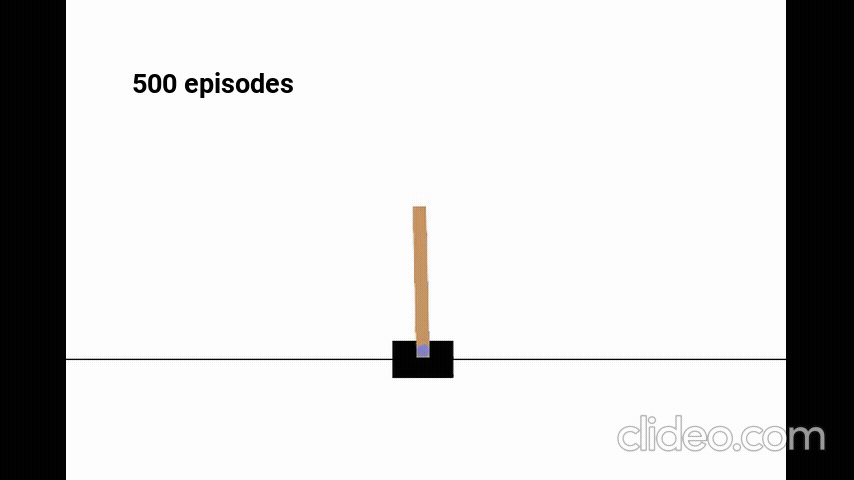
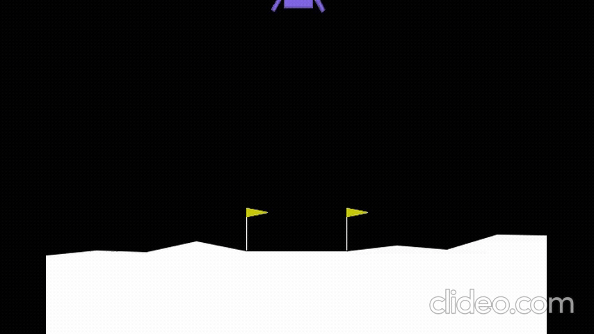
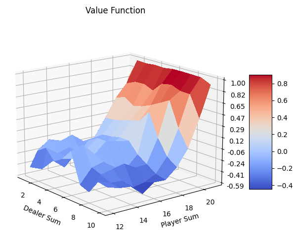

# Reinforcement Learning for Games

Welcome to the Reinforcement Learning repository! This repository contains implementations of several key reinforcement learning algorithms. Each algorithm is contained within its own directory and includes necessary code, instructions, and examples for running and understanding the algorithm.

## Table of Contents
- [Q-Learning](#q-learning)
- [Deep Q-Learning](#deep-q-learning)
- [REINFORCE](#reinforce)
- [A2C (Advantage Actor-Critic)](#a2c-advantage-actor-critic)
- [A3C (Asynchronous Advantage Actor-Critic)](#a3c-asynchronous-advantage-actor-critic)
- [PPO (Proximal Policy Optimization)](#ppo-proximal-policy-optimization)
- [MCTS (Monte Carlo Tree Search)](#mcts-monte-carlo-tree-search)

## Q-Learning
### Description
Q-Learning is a model-free reinforcement learning algorithm that seeks to find the best action to take given the current state. It does this by learning a Q-value function that estimates the expected utility of taking a given action in a given state. You can find the code [here](./qlearning/).

### Results
 
 

## Deep Q-Learning

### Description
Deep Q-Learning (DQN) extends Q-Learning by using a neural network to approximate the Q-value function. This allows it to handle high-dimensional state spaces. You can find the code [here](./DeepQLearning/).

### Results

## REINFORCE

### Description
REINFORCE is a policy gradient method that directly optimizes the policy by updating it in the direction of the gradient of the expected reward. You can find the code [here](./src/3_reinforce/).

## A2C (Advantage Actor-Critic)

### Description
A2C is an actor-critic method where the policy (actor) is updated using gradients weighted by an estimate of the advantage function provided by the critic. You can find the code [here](./src/4_a2c/).

## A3C (Asynchronous Advantage Actor-Critic)

### Description
A3C extends A2C by running multiple instances of the environment in parallel, each updating a shared model asynchronously. This often leads to faster training and more robust learning. You can find the code [here](./src/5_a3c/).

## PPO (Proximal Policy Optimization)

### Description
PPO is a policy gradient method that uses a surrogate objective function to ensure that the updates do not deviate too far from the previous policy, thereby stabilizing training. You can find the code [here](./ppo/).

### Results

## MCTS (Monte Carlo Tree Search)

### Description
Those algorithms are used to estimate the state-value function of any policy. By updating this function we can improve the policy of the agent and therefore have a better playing agent. MCTS allows for searching the best moves based on statistics rather than full exploration. You can find the code [here](./src/7_montecarlo/).

### Results

---
